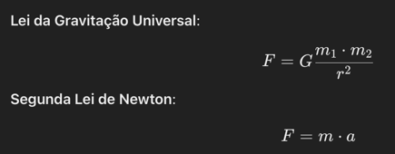

# 🌌 Simulador de Órbitas Planetárias (2D e 3D)

Este é um simulador completo de órbitas planetárias desenvolvido em **C#** que modela a dinâmica dos corpos celestes do Sistema Solar utilizando as leis da gravitação universal de Newton.  
O projeto suporta **visualização 2D** e **visualização 3D interativa**, ambas derivadas da mesma simulação física.



---

## Funcionalidades

### F1 — Simulação Física Realista
- Modelagem baseada na gravitação universal.
- Suporte a planetas, luas e múltiplos corpos arbitrários.
- Intervalos temporais configuráveis.

### F2 — Cálculo de Interações Gravitacionais
- Força gravitacional calculada para todos os pares de corpos.
- Atualização contínua das velocidades e posições via integração numérica.

### F3 — Visualização 2D com OxyPlot
- Trajetórias orbitais em 2D com diferentes cores.
- Exportação automática para PNG no diretório **`Plots`**.
- Nomes exibidos na posição final das órbitas.

### F4 — Visualização 3D Interativa com OpenTK (OpenGL)
- Janela 3D com:
    - Rotação do espaço (orbit camera)
    - Zoom com scroll
    - Cores distintas por corpo de acordo com o planeta real
    - Renderização via shaders
    - Esferas representando os corpos celestes
- Pressione **F12** para salvar um screenshot em **`Plots/screenshot_3D_*.png`**

### F5 — Exportação das Imagens
- **2D:** PNG via OxyPlot + SkiaSharp
- **3D:** Captura do framebuffer OpenGL via ImageSharp
- Todas as imagens são salvas no mesmo diretório:

```
/Plots
```

---

## 🧰 Tecnologias Utilizadas

### Backend
- **C# (.NET 9)**
- **Math.NET Numerics** – cálculos físicos e matemáticos
- **Newtonian Physics Engine (custom)**

### Visualização 2D
- **OxyPlot**
- **SkiaSharp**

### Visualização 3D
- **OpenTK 4.0 (OpenGL 3.3 Core)**
- **ImageSharp**
- **GLSL shaders**

---

## ⚙️ Como Funciona o Simulador

### 1️⃣ Inicialização
Cada corpo é definido com:
- massa
- posição inicial
- velocidade inicial

### 2️⃣ Cálculo das Forças
Para cada par de corpos:

$begin:math:display$
F = G \\frac{m_1 m_2}{r^2}
$end:math:display$

### 3️⃣ Integração Temporal
A cada passo:

$$
v = v + a \cdot \Delta t
$$

$$
x = x + v \cdot \Delta t
$$

### 4️⃣ Armazenamento das Trajetórias
Todos os pontos são registrados para posterior plotagem.

### 5️⃣ Plotagem e Exportação
- O **Plotter2D** gera o PNG automaticamente.
- O **Plotter3D** exibe a simulação em tempo real e salva screenshots com F12.

---

## 📁 Estrutura do Projeto

```
/sources
   /Models
       Body.cs
   /Simulation
       Simulator.cs
   /Plotters
       Plotter2D.cs
       Plotter3D.cs
   /shaders
       basic.vert
       basic.frag
   Program.cs
/Plots
```

### Arquivos-chave

- **Simulator.cs** — núcleo da física do sistema.
- **Plotter2D.cs** — renderização das órbitas em plano 2D.
- **Plotter3D.cs** — visualização e renderização OpenGL.
- **Body.cs** — representa cada corpo celeste.
- **Shaders** — definem o comportamento visual no 3D.

---

## ▶️ Exemplo de Uso

No `Program.cs`:

```csharp
Simulator simulator = new();
simulator.ExecuteInteractive();
```

### Saída:

- **2D:**  
  `Plots/solar_system_simulation_2d_yyyyMMdd_HHmmss.png`

- **3D:**  
  Pressione **F12** na janela e será salvo em:  
  `Plots/solar_system_simulation_2d_yyyyMMdd_HHmmss.png`

---

## 🖼 Exemplo de Gráfico 2D


## 🖼 Exemplo de Gráfico 3D


---

## 🧪 Roadmap (Próximas Funcionalidades)

- Animação real-time contínua no 3D
- Melhoria dos shaders (Phong/Blinn-Phong)
- Visualização de vetores (velocidade, aceleração, força)
- Controles adicionais via UI

---

## 📜 Licença
Este projeto é open-source. Sinta-se livre para modificar e expandir.